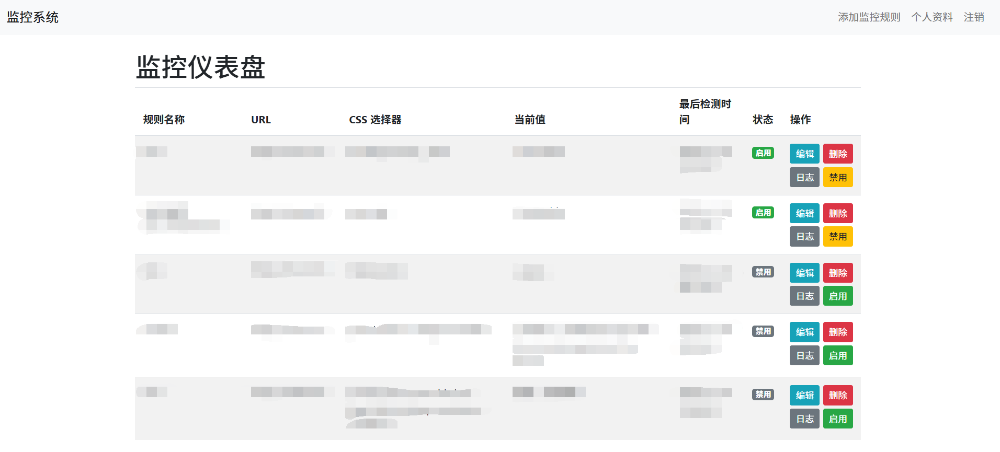
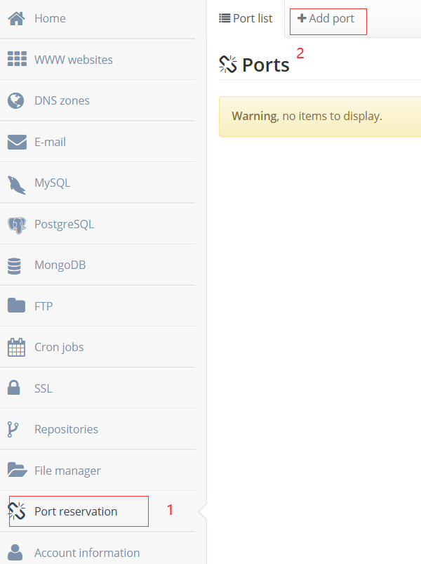
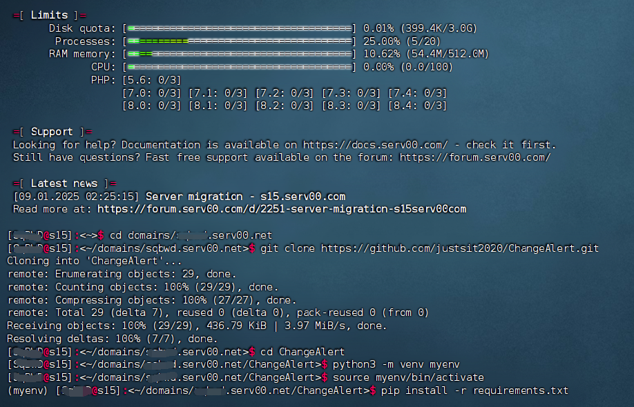
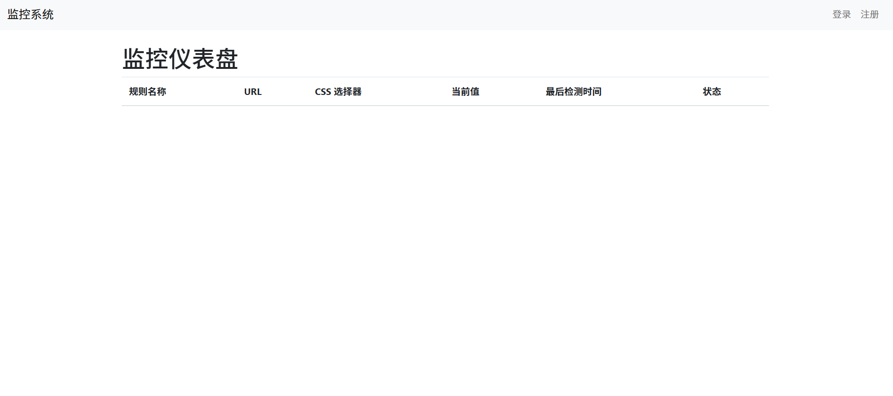
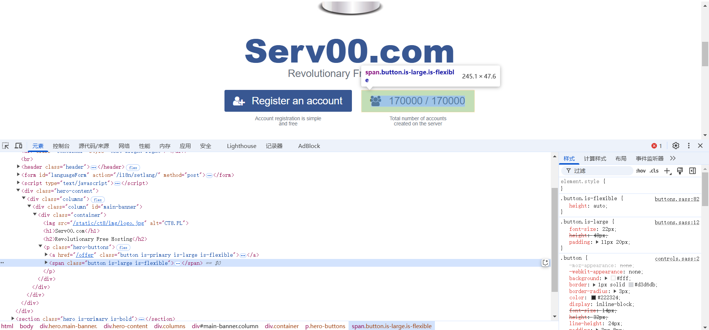

# Serv00-ChangeAlert
Click to switch language [简体中文](README.zh_CN.md) | [繁體中文](README.zh_TW.md)

This project is a web monitoring application based on Flask, which is used to periodically capture the content of a specified web page, detect changes and record logs. It also supports email notifications and front-end prompt sounds.

---

## Function Overview

- **Web Content Monitoring**: Periodically capture the content of the target URL web page, use CSS selectors to extract specified elements, and detect whether the content has changed.

- **User Management**: Provides user login, logout and profile update functions. (The registration function is closed by default and can be enabled as needed)

- **Monitoring Rule Management**: Allows users to add, edit and delete monitoring rules. Each rule contains information such as name, URL, CSS selector, and prompt sound URL.

- **Log Recording**: Whenever a monitoring rule detects a change in web page content, the old value, new value and change time are recorded in the log table.

- **Email Notification**: If the email notification function is enabled, the system will automatically send an email reminder when a web page change is detected.
- **Front-end prompt sound**: When the monitoring rules change, the front-end can play the prompt sound. The default prompt sound file is located in `static/sounds/default.mp3`.

---

## Deployment steps

1. **Environment preparation**
- Install Python 3.6 and above.
- It is recommended to use a virtual environment:
```bash
python3 -m venv venv
# Linux/MacOS
source venv/bin/activate
# Windows
venv\Scripts\activate
```

2. **Specific deployment steps**
- First open the ``Serv00`` control panel, add the upper permission and the corresponding port

- Use SSH to connect to ``Serv00`` and locate the location where you need to install

```bash
cd domains/username.serv00.net # Here, username is filled in according to the actual user name
git clone https://github.com/justsit2020/ChangeAlert.git # Clone my project
cd ChangeAlert
python3 -m venv myenv # Create a virtual environment
source venv/bin/activate # Activate the virtual environment
pip install -r requirements.txt # Install related libraries
```



- Modify the relevant settings of ``app.py``. The optional modifications are as follows:

```bash
NOTIFICATION_ENABLED = True # Whether to enable email notifications, turn on True
MAIL_SERVER = 'smtp.example.com' # Replace with your SMTP server address
MAIL_PORT = 587 # SMTP port, commonly used ports are 587 (TLS) or 465 (SSL)
MAIL_USERNAME = 'SMTP Username' # SMTP username
MAIL_PASSWORD = 'SMTP Password' # SMTP password
MAIL_FROM = 'sender@example.com' # Sender's email address
MAIL_TO = 'receiver@example.com' # Email address for receiving notifications
app.secret_key = 'fiZWLrANSBgtfnQ7' # Please set it to a random string
app.config['REGISTRATION_ENABLED'] = True # False means to turn off the registration function. It is recommended to turn it off after registration
```

- The places that must be modified are as follows:
```bash
app.run(host='0.0.0.0', port=8080, debug=False) # Fill in the requested port for the port
```

- Use the following command to start the code and run it in the background
```bash
screen python app.py # Start the code. If the process is killed, you can still use this command to restart it
```

- You can use ``screen -list`` to view the process number and use ``screen -r process number`` to view the background code and use ``ctrl+a`` ``d`` to separate the process

- Enter the URL ``username.serv00.net:port`` to enter the panel and register. It is recommended to close the process after successful registration and turn off the registration function

3. **Edit rules**
- After logging in, click Add Monitoring Rule in the upper right corner, customize the rule name, fill in the URL to be monitored, and refer to the following steps for the setting of the CSS selector:
- Use ``ctrl+shift+c`` and click the value to be monitored with the mouse, try to select a smaller range, and fill in the CSS selector ``span.button.is-large.is-flexible``
- The prompt sound can be selected. If it is not filled in, the default prompt sound is not enabled by default. After opening the web page, if you need the prompt sound, you need to click the monitoring system in the upper left corner to turn it on and cannot refresh it, because the browser blocks the rule of playing the prompt sound by default. After clicking, a silent audio will be played.
- If the website has cloudflare's five-second shield, you can choose to use Cloudscraper, but it is not 100% passable. It may not pass for a certain period of time, which may be related to the refresh time.
- Notification email configuration is optional. If it is not filled in, the default is to send messages according to the email configured in ``app.py`` (if notifications are turned on)

4. **Thanks**
- Finally, I would like to thank serv00 officials for providing such a good free server for everyone to learn and use. This project has a simple interface. If there are any incomplete places, I hope that those who are capable can optimize it and open source it. It will be an honor for me if you can bring me along. This project is completed under the guidance of AI. Please do not use it commercially.
