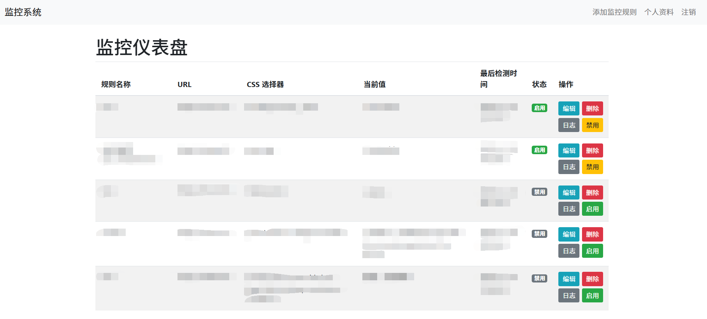
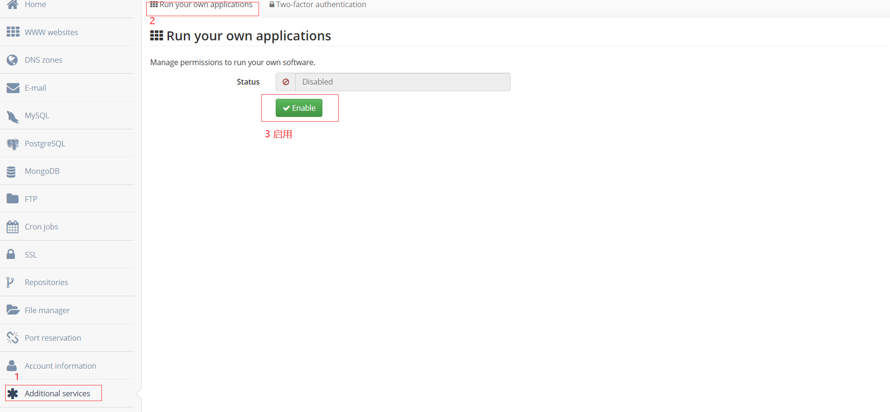
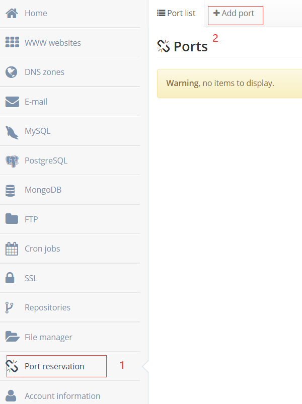
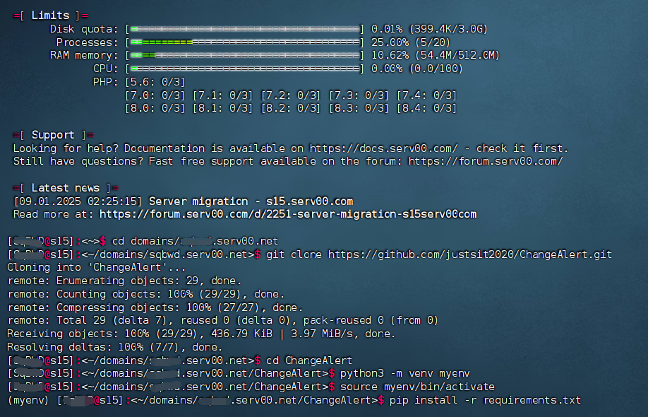
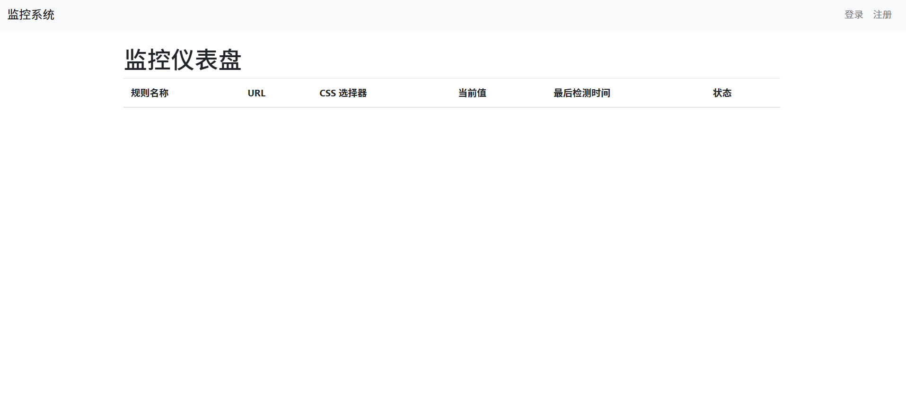
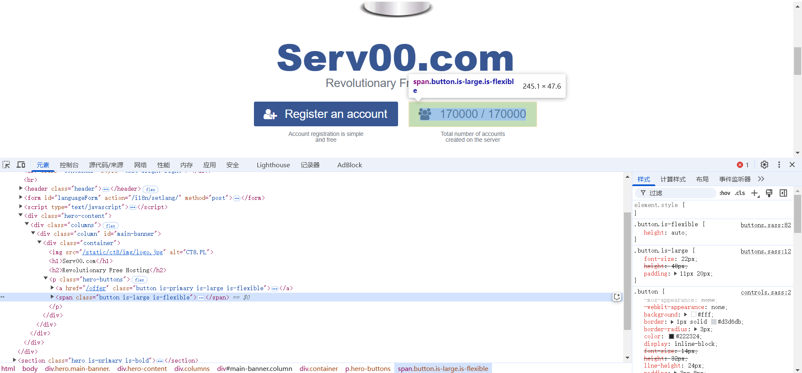

# Serv00-ChangeAlert
点击切换语言 [English](README.md) | [繁體中文](README.zh_TW.md)

该项目是一个基于 Flask 的网页监控应用，用于定时抓取指定网页内容、检测变化并记录日志，同时支持邮件通知和前端提示音功能。

---


## 功能概述


- **网页内容监控**：定时抓取目标 URL 网页内容，使用 CSS 选择器提取指定元素，检测内容是否发生变化。
- **用户管理**：提供用户登录、注销以及资料更新功能。（注册功能默认关闭，可根据需要开启）
- **监控规则管理**：允许用户添加、编辑、删除监控规则，每条规则包含名称、URL、CSS 选择器、提示音 URL 等信息。
- **日志记录**：每当监控规则检测到网页内容变化时，记录旧值、新值以及变化时间到日志表中。
- **邮件通知**：若启用邮件通知功能，当检测到网页变化时，系统会自动发送邮件提醒。
- **前端提示音**：当监控规则变化时，前端可播放提示音，默认提示音文件位于 `static/sounds/default.mp3`。


---


## 部署步骤


1. **环境准备**  
- 安装 Python 3.6 及以上版本。  
- 推荐使用虚拟环境：
```bash
python3 -m venv venv
# Linux/MacOS
source venv/bin/activate
# Windows
venv\Scripts\activate
```


2. **具体部署步骤** 
- 首先打开 ``Serv00`` 控制面板，添加上运行权限和相应端口
  
- 使用SSH连接 ``Serv00`` 后定位到需要安装的位置
  
```bash
cd domains/username.serv00.net # 此处username按实际用户名填写
git clone https://github.com/justsit2020/ChangeAlert.git # 克隆我的项目
cd ChangeAlert
python3 -m venv myenv # 创建虚拟环境
source venv/bin/activate # 激活虚拟环境
pip install -r requirements.txt # 安装相关库
```




- 修改``app.py``相关设置，可选择修改的地方如下：
  
```bash
NOTIFICATION_ENABLED = True  # 是否启用邮件通知，开启为True
MAIL_SERVER = 'smtp.example.com'  #  替换为您的 SMTP 服务器地址
MAIL_PORT = 587  #  SMTP 端口，常用端口为 587 (TLS) 或 465 (SSL)
MAIL_USERNAME = 'SMTP Username'  #  SMTP 用户名
MAIL_PASSWORD = 'SMTP Password'  #  SMTP 密码
MAIL_FROM = 'sender@example.com'  #  发件人邮箱地址
MAIL_TO = 'receiver@example.com'  #  接收通知的邮箱地址
app.secret_key = 'fiZWLrANSBgtfnQ7'  # 请设置为随机字符串
app.config['REGISTRATION_ENABLED'] = True  # False是关闭注册功能，建议注册后关闭
```

- 必须要修改的地方如下：
```bash
app.run(host='0.0.0.0', port=8080, debug=False) # 端口填写申请的端口
```

- 使用以下命令启动代码并将其在后台运行
```bash
screen python app.py # 启动代码,若进程被杀依旧可以使用此命令重启
```

- 可使用``screen -list``查看进程号并使用``screen -r 进程号``查看后台代码并使用``ctrl+a`` ``d``分离进程
  
- 输入网址``用户名.serv00.net:端口``进入面板后进行注册，建议注册成功后关闭进程，将注册功能关闭

3. **编辑规则**
- 登录后点击右上角的添加监控规则，规则名称自定义，URL填写需要监控的URL，css选择器的设置参考以下步骤：
- 使用``ctrl+shift+c``并用鼠标点击需要监控的值，尽量范围选择小一些，css选择器即可填写``span.button.is-large.is-flexible`` 
- 提示音可选择填写，不填写默认提示音，此提示音不是默认开启，打开网页后如需要提示音需要点击左上角的监控系统开启而不能刷新，因为浏览器默认阻止了播放提示音的规则，点击后会播放一段静音的音频。
- 若网站有cloudflare的五秒盾可以选择勾选使用 Cloudscraper，不过并不是百分百能通过，有一定时间不能通过，可能与刷新时长有关
- 通知邮箱配置可选填，如果不填写默认按照``app.py``中配置的邮箱发送消息（如果开启了通知）


4. **鸣谢**
- 最后很感谢serv00官方能提供这么好的免费服务器供大家学习使用，此项目界面简单，若有不完备的地方希望有能力者能优化一下并进行开源，如能带上本人将不胜荣幸，此项目皆在AI指导下完成，请禁止商用。


