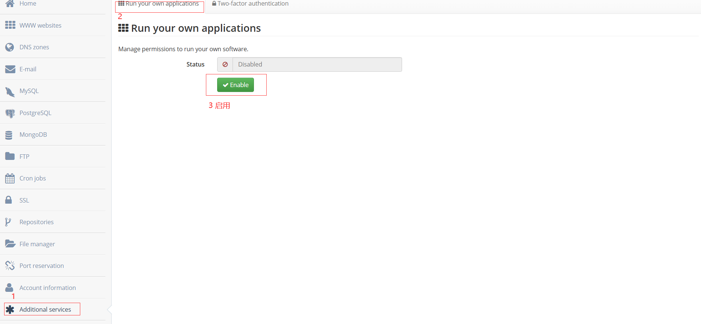

# Serv00-ChangeAlert
該項目是一個基於Flask的網頁監控應用，用於定時抓取指定網頁內容、檢測變化並記錄日誌，同時支持郵件通知和前端提示音功能。

---

## 功能概述

- **網頁內容監控**：定時抓取目標URL網頁內容，使用CSS選擇器選取指定元素，檢測內容是否發生變化。
- **用戶管理**：提供用戶登錄、註銷以及資料更新功能。 （注册功能默認關閉，可根據需要開啟）
- **監控規則管理**：允許用戶添加、編輯、删除監控規則，每條規則包含名稱、URL、CSS選擇器、提示音URL等資訊。
- **日誌記錄**：每當監控規則檢測到網頁內容變化時，記錄舊值、新值以及變化時間到日誌錶中。
- **郵件通知**：若啟用郵件通知功能，當檢測到網頁變化時，系統會自動發送郵件提醒。
- **前端提示音**：當監控規則變化時，前端可播放提示音，默認提示音檔案位於`static/sounds/default.mp3`。

---

## 部署步驟

1. **環境準備**
-安裝Python 3.6及以上版本。
-推薦使用虛擬環境：
```bash
python3 -m venv venv
# Linux/MacOS
source venv/bin/activate
# Windows
venv\Scripts\activate
```

2. **具體部署步驟**
- 首先打開``Serv00``控制台，添加上運行許可權和相應埠
   
- 使用SSH連接``Serv00``後定位到需要安裝的位置
   
```bash
cd domains/username.serv00.net # 此處username按實際用戶名填寫
git clone  https://github.com/justsit2020/ChangeAlert.git # 尅隆我的項目
cd ChangeAlert
python3 -m venv myenv # 創建虛擬環境
source venv/bin/activate # 啟動虛擬環境
pip install -r requirements.txt # 安裝相關庫
```
   


   
- 修改``app.py``相關設定，可選擇修改的地方如下：
     
```bash
NOTIFICATION_ENABLED = True # 是否啟用郵件通知，開啟為True
MAIL_SERVER = 'smtp.example.com' # 替換為您的SMTP伺服器地址
MAIL_PORT = 587 # SMTP埠，常用埠為587（TLS）或465（SSL）
MAIL_USERNAME = 'SMTP Username' # SMTP用戶名
MAIL_PASSWORD = 'SMTP Password' # SMTP密碼
MAIL_FROM = ' sender@example.com ' # 發件人郵箱地址
MAIL_TO = ' receiver@example.com ' # 接收通知的郵箱地址
app.secret_key = 'fiZWLrANSBgtfnQ7' # 請設定為隨機字串
app.config['REGISTRATION_ENABLED'] = True # False是關閉注册功能，建議注册後關閉
```
     
- 必須要修改的地方如下：
```bash
app.run（host='0.0.0.0'，port=8080，debug=False）# 埠填寫申請的埠
```
     
- 使用以下命令啟動程式碼並將其在後臺運行
```bash
screen python app.py # 啟動程式碼，若行程被殺依舊可以使用此命令重啓
```
     
- 可使用``screen -list``查看行程號並使用``screen -r 行程號``查看後臺程式碼並使用``ctrl+a`` ``d``分離行程
   
- 輸入網址``用戶名.serv00.net:埠``進入面板後進行注册，建議注册成功後關閉行程，將注册功能關閉

3. **編輯規則**
- 登入後點擊右上角的添加監控規則，規則名稱自定義，URL填寫需要監控的URL，css選擇器的設定參攷以下步驟：
- 使用``ctrl+shift+c``並用滑鼠點擊需要監控的值，儘量範圍選擇小一些，css選擇器即可填寫``span.button.is-large.is-flexible``
- 提示音可選擇填寫，不填寫默認提示音，此提示音不是默認開啟，打開網頁後如需要提示音需要點擊左上角的監控系統開啟而不能重繪，因為瀏覽器默認封锁了播放提示音的規則，點擊後會播放一段靜音的音訊。
- 若網站有cloudflare的五秒盾可以選擇勾選使用Cloudscraper，不過並不是百分百能通過，有一定時間不能通過，可能與重繪時長有關
- 通知郵箱配寘可選填，如果不填寫默認按照``app.py``中配寘的郵箱發送消息（如果開啟了通知）

4. **鳴謝**
- 最後很感謝serv00官方能提供這麼好的免費服務器供大家學習使用，此項目介面簡單，若有不完備的地方希望有能力者能優化一下並進行開源，如能帶上本人將不勝榮幸，此項目皆在AI指導下完成，請禁止商用。
